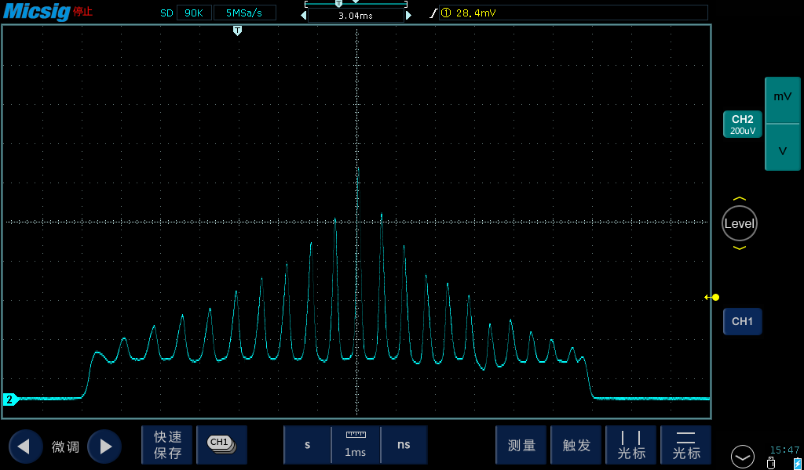
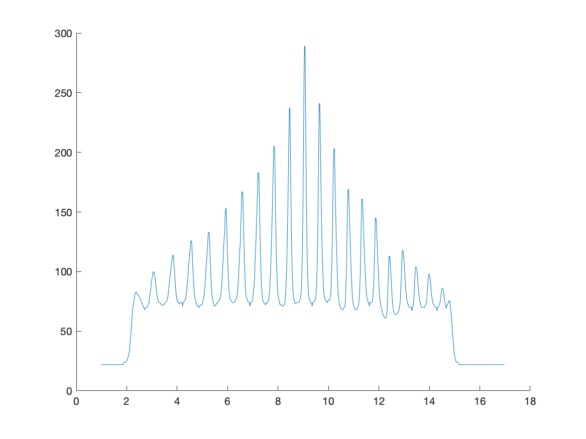

# Plot Extractor
The **Plot Extractor** is a script that can help you to extract data from an image file that contains a graph/plot/diagram. 

## How to use (src-matlab)
1. Configure the script using `Script configuration` section. _(How to config: to be written)_
2. Run the script and check the two output files. 
   1. File 1: Image snapshot. 
   2. File 2: Raw data in CSV-format. 

## Example 
### Input 

### Output

## License 
Please see [license](LICENSE)
